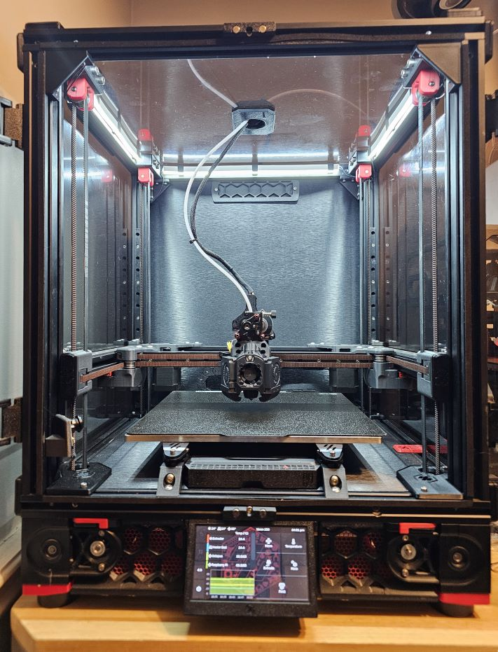

# Ender 5 (STD/PRO) to Voron 2.4 Conversion

## Summary

A few years ago, I converted my Ender 5 to a Voron 2.4. Since posting it to <a href="https://www.reddit.com/r/ender5/comments/p8z4o2/comment/mcerxhc/?context=3">Reddit</a>, I have received several requests for more info (mainly the STLs I modified to accommodate the 4020 vertical extrusions).

## But Why?

My reason for the conversion was simple. I wanted:

- CoreXY printer similar to my Tronxy X5SA Pro (which btw, was also eventually converted to a Voron 2.4)
- Increase support for the bed
- Klipper
- Enclosed printer for printing ABS/ASA

Although I didn't have one at the time, I was a big fan of the Voron 2.4. It met all of the above requirements. Without any previous printer-building experience, I tore the Ender 5 apart and began to slowly build it back up as a Voron 2.4.

## The Journey

I originally converted it to a "stock" Voron 2.4 and re-used the following:

- Frame
- Power supply
- Creality 4.2.7 board
- Motors
- Bed/heater

I have to admit that once I had it down to just the frame, I started questioning why I was even doing this. Once done, I didn't regret the knowledge I had gained.

I eventually replaced:

- the thin/warped bed with a standard 9mm cast aluminum
- the motors with some higher torque motors (Cuerrently using some OMC/Stepper Online motors)
- the board with a BigTreeTech Octopus

At this point, the printer also consists of:

- <a href="https://github.com/Armchair-Heavy-Industries/Xol-Toolhead">XOL toolhead</a> with Vz-Hextrudort, Phaetus Rapido 2 and Mellow Fly-SHT36 Can Bus toolhead PCB
- 48V PSU and 5160 Pro drivers
- Titanium extrusion backers
- Pi Cam
- <a href="https://github.com/tanaes/whopping_Voron_mods/blob/main/kinematic_bed/README_v2_assembly.md">Kinematic Bed Mounts</a>
- Opaque panels wrapped in brushed metal and clear panels tinted
- KlipperScreen using 4.3" Waveshare DSI screen

I also added the following mods:

- <a href="https://github.com/Ramalama2/Voron-2-Mods/tree/main/Front_Idlers">Ramalama Front Idlers</a>
- <a href="https://mods.vorondesign.com/details/C8XJJ0fBGfBFKQZctjKeA">Pins Mod</a>
- <a href="https://github.com/nevermore3d/Nevermore_Micro">Nevermore carbon filter</a>
- Chamber LEDs

## Disclaimer

- Print Area - Depending on the bed size, you will lose some print area on the Y axis along with Z. My current print area with the standard 250mm bed is currently 250 mm x 210 mm x 210mm. Z can be a bit taller without the kinematic mounts.
- If you want to enclose the printer, you will need have your own deck acrylic panel cut. The DXF is included. You can also order a set of Voron 2.4 250mm panels and trim 20mm at each corner to ensure the Z belts can clear the panel.
- There are many other conversions that are much easier and cheaper and may make more sense to you (eg. <a href="https://docs.zerog.one/manual/build/mercury_eva">Zero G Mercury One</a>, <a href="https://vorondesign.com/voron_trident">Voron Trident</a>, etc)

## How?

- The process isn't that complicated, especially with the amount of documentation available by the Voron Team.
- The frame will need to be rotated 90 degrees (on the XY axis) in order for the 4020 extrusions to be turned the other way and provide a wider access from the front.
- You can check out the Voron 2.4 Configurator for the rail and extrusion lengths. The printer size is similar to the 250 (410 x 410 x 440 vs the standard Voron 2.4 250mm size of 410 x 410 x 430). However, the X gantry extrusions and rails will need to be 40mms shorter than the recommended size due to the 4020 extrusions.
- The printer should be built the same way as a Voron 2.4 250mm. All standard printed parts other than the ones in this repo will be used.
